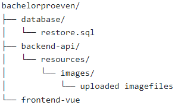

# Final Project - Bachelor thesis

## Folder structure

## Database

Open your Workbench and create an SQL script that:
* Create a new table 'Bachelor tests' with the following properties:
    * An id that is filled in automatically and can never be null.
    * A title, cannot be null
    * A description, cannot be null
    * A student1 cannot be null
    * A student2, may be null
    * An image, may not be null
    * An academic year, may not be null
    * A company, may not be null

When your script is ready, you run it in the database VIVES so that the table with content is created there.

You save the script in a file 'restore.sql'

## Backend API

Now build your backend application in the `backend-api` folder.
Provide the following routes:
* A route to receive HTTP GET request to `/bachelorthesis`.
This will give you all bachelor's theses
* A route to handle HTTP GET request to `/bachelorthesis` with a specific id as parameter
This will give you the bachelor's thesis with that id
* A route to handle HTTP PUT request to `/bachelorthesis` with a specific id as parameter
This will update the bachelor's thesis with that id
* A route to receive HTTP POST request to `/bachelorthesis`
This will add a new Bachelor's thesis
* A route to handle HTTP DELETE request to `/bachelorthesis` with a specific id as parameter
This deletes the bachelor's thesis with that id
* A route to receive an HTTP GET request to `/images/<filename>`
This will download the file.
* A route to receive HTTP POST request to `/upload`
Uploads a file to 'resoucres/images'
* An error to catch HTTP DELETE request to `/images` with a specific filename as parameter.
This deletes a specific file from the `resources/images` folder

## Frontend UI

Build a frontend application called `frontend-vue`.

* Provide a navigation bar with 'Home' & 'Admin'
* The Home view displays the Bachelor's theses in map form, there is a filter section in which you can enter certain filters, such as student name, academic year, word in description, company.
* The Admin view displays the Bachelor's theses in table form. There is always an 'edit' and a 'delete' button. There is also an 'Add' button below the table.
* When deleting, you don't use an alert, but a nice popup diaglog.
* After submitting the form to fill in the bachelor test information, there is validation, for example, mandatory fields must be filled in and the image may not be larger than 2MB and is limited to '.png, .jpg and .jpeg', there must be feedback to the user in case of errors.

You use Axios for communication with the backend API and Bootstrap and/or Vuetify as styling.

## Deployment

Once your application works locally, you deploy it on `<location>` in a docker container.